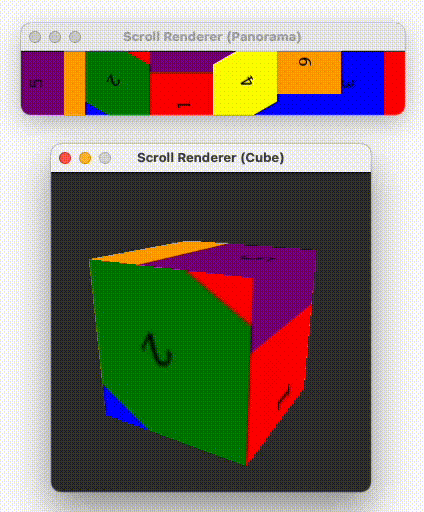

# LED Jukebox Visualizer
This repository is for visualizing the [LED-Jukebox](https://github.com/ubiquitous-o/LED-Jukebox). It allows you to visualize the operation of LED-Jukebox on devices with displays. And, it serves as a rendering library for LED-Jukebox.

